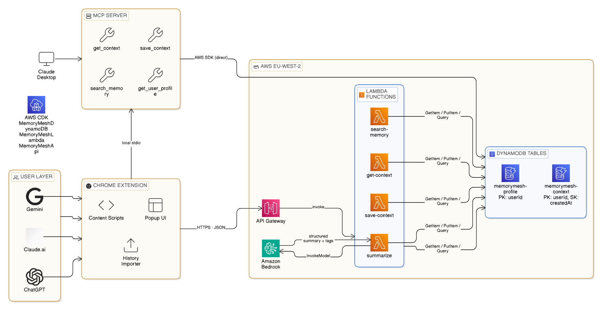

# ⬡ MemoryMesh

**Portable AI memory — carry your context across Claude, ChatGPT, and Gemini.**

[](./LICENSE)
[](https://www.typescriptlang.org/)
[](https://aws.amazon.com/cdk/)
[](https://modelcontextprotocol.io/)

**[Setup Guide](docs/SETUP.md) · [Contributing](docs/CONTRIBUTING.md) · [Changelog](docs/CHANGELOG.md) · [Security](docs/SECURITY.md)**

---

## The Problem

Every AI tool starts from zero. Switch from Claude to ChatGPT mid-project and you lose everything — your decisions, your context, your progress. AI memory is siloed by design.

## The Solution

MemoryMesh is a portable context layer that persists your AI conversations to your own AWS backend and injects them into any tool on demand. Your context travels with you.

> **Real result:** After importing and syncing 58 Claude + ChatGPT conversations, Gemini responded:
>
> *"It looks like we've been working through a dense sprint involving the LandLedger platform, quantum neural network optimizations, and various AWS infrastructure labs... I'm ready to pick up exactly where we left off."*
>
> — Gemini, with zero native memory, after a MemoryMesh sync.

---

## Features

| **Feature** | **Description** |
|-------------|-----------------|
| 🔄 **Cross‑tool sync** | Save context inside Claude and inject it into ChatGPT or Gemini with one click. |
| 🧠 **AI summarisation** | Sentences are automatically summarised by Amazon Bedrock (Claude Haiku) and tagged semantically. |
| 📦 **Bulk history import** | Drop a ChatGPT/Claude export ZIP and import months of conversations in minutes. |
| 🔌 **MCP server** | Provides native Claude Desktop integration via the Model Context Protocol (stdio transport). |
| ☁️ **Your data, your cloud** | All memory lives in your AWS account; no third-party service sees your content. |
| ⚡ **Fully serverless** | API Gateway + Lambda + DynamoDB; you only pay for what you actually use. |

---

## Architecture



---

## Quick Start

### Prerequisites

- Node.js 20+
- AWS CLI configured for `eu-west-2`
- `npm install -g aws-cdk`
- AWS account with access to Lambda, DynamoDB, API Gateway, and Bedrock

### 1. Clone and install

```bash
git clone https://github.com/yorliabdulai/contextbridge.git
cd contextbridge
npm install
```

### 2. Deploy AWS infrastructure

```bash
cd packages/infrastructure
npm install
cdk bootstrap
cdk deploy --all
```

### 3. Build and deploy Lambda functions

```bash
cd ../mcp-server
npm run build
# See docs/SETUP.md for the full Lambda packaging and deploy commands
```

### 4. Load Chrome extension

```bash
cd ../extension
npm install && npm run build
# Chrome → chrome://extensions → Developer mode → Load unpacked → select packages/extension/dist/
```

### 5. Configure MCP server (Claude Desktop)

Add to `%APPDATA%\Claude\claude_desktop_config.json` (Windows) or `~/Library/Application Support/Claude/claude_desktop_config.json` (macOS):

```json
{
  "mcpServers": {
    "memorymesh": {
      "command": "node",
      "args": ["path/to/memorymesh/packages/mcp-server/dist/index.js"],
      "env": {
        "AWS_REGION": "eu-west-2",
        "CONTEXT_TABLE": "memorymesh-context",
        "PROFILE_TABLE": "memorymesh-profile",
        "MEMORYMESH_USER_ID": "your-uuid",
        "AWS_ACCESS_KEY_ID": "your-key",
        "AWS_SECRET_ACCESS_KEY": "your-secret"
      }
    }
  }
}
```

> 📖 **Full setup guide with step-by-step commands and screenshots:** [docs/SETUP.md](./docs/SETUP.md)

---

## Project Structure

```
contextbridge/
├── package.json                   # npm workspaces root
├── README.md
├── LICENSE
├── docs/
│   ├── SETUP.md                   # Full installation guide
│   ├── CONTRIBUTING.md
│   ├── CHANGELOG.md
│   ├── SECURITY.md
│   └── architecture.png
├── .github/
│   ├── ISSUE_TEMPLATE/
│   │   ├── bug_report.md
│   │   └── feature_request.md
│   └── workflows/
│       └── ci.yml
└── packages/
    ├── extension/                 # Chrome extension (Manifest V3)
    │   └── src/
    │       ├── manifest.json
    │       ├── background.ts
    │       ├── content/           # Per-tool DOM injection scripts
    │       │   ├── claude.ts
    │       │   ├── chatgpt.ts
    │       │   └── gemini.ts
    │       ├── popup/             # Extension popup UI
    │       ├── import/            # Bulk history importer page
    │       └── utils/api.ts       # HTTP client for API Gateway
    ├── infrastructure/            # AWS CDK (3 stacks)
    │   └── lib/
    │       ├── dynamodb-stack.ts
    │       ├── lambda-stack.ts
    │       └── api-stack.ts
    └── mcp-server/                # MCP server + Lambda handlers
        └── src/
            ├── index.ts           # stdio entry point
            ├── server.ts          # MCP tool definitions
            ├── lambda/            # Lambda handler entry points
            ├── tools/             # Shared business logic
            ├── aws/dynamodb.ts
            └── types/index.ts
```

---

## Tech Stack

| **Layer**          | **Technology** |
|--------------------|---------------|
| **Chrome Extension** | TypeScript<br>Webpack 5<br>Manifest V3<br>JSZip |
| **MCP Server**      | TypeScript<br>`@modelcontextprotocol/sdk`<br>AWS SDK v3<br>stdio transport |
| **API**             | AWS API Gateway (HTTP API) |
| **Compute**         | AWS Lambda (Node.js 20) |
| **Storage**         | AWS DynamoDB (`PAY_PER_REQUEST`) |
| **AI Summarisation** | Amazon Bedrock — `eu.anthropic.claude-haiku-4-5-20251001-v1:0` (EU cross-region inference) |
| **Infrastructure**  | AWS CDK (TypeScript) — 3 stacks |
| **Monorepo**        | npm workspaces |
| **Region**          | `eu-west-2` (London) |

---

## API Endpoints

| **Method** | **Path** | **Description** |
|------------|----------|---------------|
| `POST`    | `/context`                         | Save a new context entry |
| `GET`     | `/context/{userId}?limit=N`       | Retrieve stored entries (default: 1000) |
| `GET`     | `/search/{userId}?query=<term>`   | Keyword search across user context |
| `GET`     | `/profile/{userId}`               | Fetch or create the user profile |
| `POST`    | `/summarize`                      | Perform Bedrock summarisation on text |

---

## Roadmap

- [ ] Firefox extension port
- [ ] Support for Perplexity and Mistral
- [ ] Local SQLite backend (no AWS required)
- [ ] Selective context injection (choose which entries to sync)
- [ ] Context tagging and search UI in the popup
- [ ] Gemini history export support (no native export currently)

---

## Contributing

Contributions are welcome. Please read [docs/CONTRIBUTING.md](./docs/CONTRIBUTING.md) before opening a PR.

---

## Security

All data is stored in your own AWS account. No data is shared across users or accessible to project maintainers. See [docs/SECURITY.md](./docs/SECURITY.md).

---

## License

MIT — see [LICENSE](./LICENSE)

---

<p align="center">Built by <a href="https://www.linkedin.com/in/abdulai-yorli/">Abdulai Yorli</a> · Ghana 🇬🇭</p>